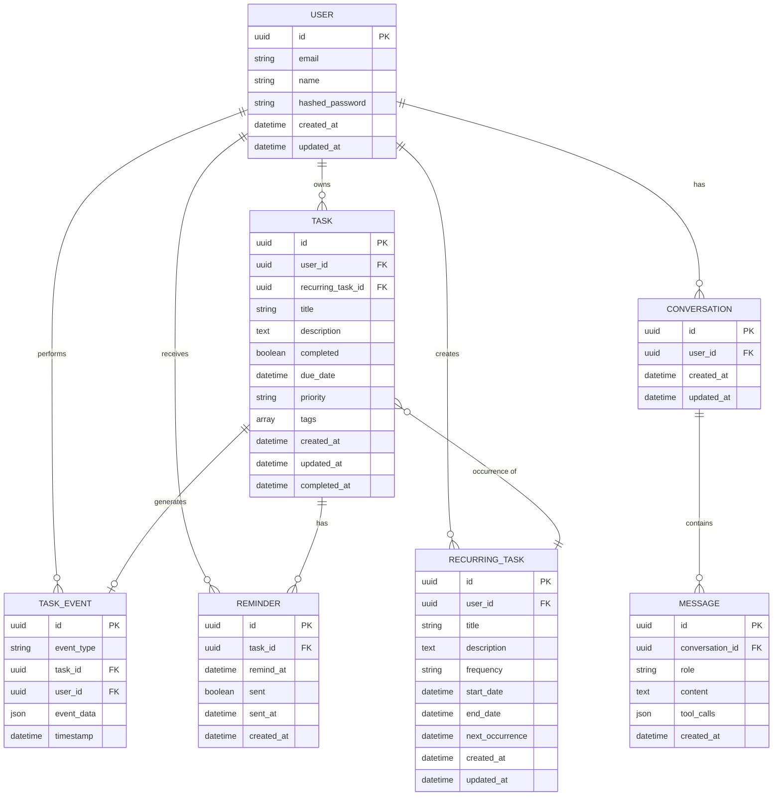

# Data Model: Advanced Cloud Deployment

**Feature**: Phase V - Advanced Cloud Deployment
**Last Updated**: 2026-02-10
**Database**: Neon Serverless PostgreSQL (SQLModel/SQLAlchemy)

---

## Overview

Phase V extends the existing database schema with advanced task management features, event-driven audit trails, reminders, and recurring tasks. All models follow the stateless architecture principle and maintain referential integrity through foreign keys.

---

## Entity Relationship Diagram



---

## Model Definitions

### 1. User (Existing - No Changes)

**Purpose**: Represents a user of the Todo AI Chatbot system.

**Fields**:
- `id` (UUID, Primary Key): Unique user identifier
- `email` (String, Unique): User's email address
- `name` (String): User's display name
- `hashed_password` (String): Bcrypt hashed password
- `created_at` (DateTime): Account creation timestamp
- `updated_at` (DateTime): Last update timestamp

**Relationships**:
- One-to-Many with Task: A user has many tasks
- One-to-Many with RecurringTask: A user has many recurring tasks
- One-to-Many with TaskEvent: A user performs many task events
- One-to-Many with Reminder: A user receives many reminders
- One-to-One with Conversation: A user has one conversation (from Phase III/IV)

**Indexes**:
- `idx_users_email`: UNIQUE index on email
- `idx_users_id`: Primary key index

**Validation Rules**:
- Email must be valid format and unique
- Password must be at least 8 characters
- Name is required and max 255 characters

---

### 2. Task (Extended for Phase V)

**Purpose**: Represents a todo item with advanced scheduling and categorization capabilities.

**Fields**:

| Field | Type | Nullable | Default | Description |
|-------|------|----------|---------|-------------|
| `id` | UUID | No | - | Primary key |
| `user_id` | UUID | No | - | Foreign key to User (owner) |
| `recurring_task_id` | UUID | Yes | NULL | Foreign key to RecurringTask (parent) |
| `title` | String(255) | No | - | Task title |
| `description` | Text | Yes | NULL | Task description |
| `completed` | Boolean | No | false | Completion status |
| **`due_date`** | DateTime | Yes | NULL | **NEW: When task is due (UTC)** |
| **`priority`** | Enum | No | 'MEDIUM' | **NEW: LOW, MEDIUM, HIGH** |
| **`tags`** | JSON/Array | Yes | [] | **NEW: List of tag strings** |
| `created_at` | DateTime | No | NOW() | Creation timestamp |
| `updated_at` | DateTime | No | NOW() | Last update timestamp |
| `completed_at` | DateTime | Yes | NULL | Completion timestamp |

**NEW Fields for Phase V**:
- `due_date`: Stores the due date in UTC. Frontend displays in user's local timezone.
- `priority`: Enum with values 'LOW', 'MEDIUM', 'HIGH'. Default is 'MEDIUM'.
- `tags`: JSON array of strings (e.g., `["work", "urgent", "meeting"]`).

**Relationships**:
- Many-to-One with User: A task belongs to one user
- Many-to-One with RecurringTask: A task can be an occurrence of a recurring task
- One-to-Many with TaskEvent: A task generates many events
- One-to-Many with Reminder: A task can have multiple reminders

**Indexes**:
- `idx_tasks_user_id`: Index on user_id for filtering
- `idx_tasks_due_date`: **NEW** Index on due_date for sorting and filtering
- `idx_tasks_priority`: **NEW** Index on priority for filtering
- `idx_tasks_completed`: Index on completed for filtering
- `idx_tasks_created_at`: Index for sorting by creation date
- **NEW** `idx_tasks_user_due_priority`: Composite index on (user_id, due_date, priority) for complex queries

**Validation Rules**:
- Title is required and max 255 characters
- Priority must be one of: 'LOW', 'MEDIUM', 'HIGH'
- Tags must be an array of strings (max 10 tags, max 50 characters each)
- due_date must be in the future when set
- completed_at is automatically set when completed=true

**State Transitions**:
```
[CREATED] → [COMPLETED] → [DELETED]
    ↓
[UPDATED] (any number of times before completion)
```

---

### 3. RecurringTask (NEW for Phase V)

**Purpose**: Template for recurring tasks that generates task occurrences automatically.

**Fields**:

| Field | Type | Nullable | Default | Description |
|-------|------|----------|---------|-------------|
| `id` | UUID | No | - | Primary key |
| `user_id` | UUID | No | - | Foreign key to User (creator) |
| `title` | String(255) | No | - | Task title template |
| `description` | Text | Yes | NULL | Task description template |
| `frequency` | Enum | No | - | DAILY, WEEKLY, MONTHLY |
| `start_date` | DateTime | No | - | First occurrence date |
| `end_date` | DateTime | Yes | NULL | Optional last occurrence date |
| `next_occurrence` | DateTime | No | - | Calculated next occurrence |
| `created_at` | DateTime | No | NOW() | Creation timestamp |
| `updated_at` | DateTime | No | NOW() | Last update timestamp |

**Relationships**:
- Many-to-One with User: A recurring task belongs to one user
- One-to-Many with Task: A recurring task has many task occurrences

**Indexes**:
- `idx_recurring_tasks_user_id`: Index on user_id
- `idx_recurring_tasks_next_occurrence`: Index for finding due tasks

**Validation Rules**:
- Title is required and max 255 characters
- Frequency must be one of: 'DAILY', 'WEEKLY', 'MONTHLY'
- start_date must be in the past or present
- end_date (if set) must be after start_date
- next_occurrence is automatically calculated based on frequency

**State Transitions**:
```
[ACTIVE] → [COMPLETED] (when end_date reached or user deletes)
[ACTIVE] → [PAUSED] (optional extension for Phase VI)
```

**Business Logic**:
- When a child Task is completed, Kafka event `task-completed` is published
- Recurring Task Service consumes event, creates next Task occurrence
- Calculates `next_occurrence` based on frequency:
  - DAILY: `current_occurrence + 1 day`
  - WEEKLY: `current_occurrence + 7 days`
  - MONTHLY: `current_occurrence + 1 month` (same day number)
- If `end_date` is set and `next_occurrence > end_date`, no new task created
- `next_occurrence` updated to reflect the next task after that

---

### 4. TaskEvent (NEW for Phase V - Audit Trail)

**Purpose**: Immutable audit trail of all task operations for compliance, debugging, and analytics.

**Fields**:

| Field | Type | Nullable | Default | Description |
|-------|------|----------|---------|-------------|
| `id` | UUID | No | - | Primary key |
| `event_type` | Enum | No | - | created, updated, completed, deleted |
| `task_id` | UUID | No | - | Foreign key to Task |
| `user_id` | UUID | No | - | Foreign key to User (actor) |
| `event_data` | JSON | No | - | Event details (before/after state) |
| `timestamp` | DateTime | No | NOW() | When event occurred |

**event_data Schema**:
```json
{
  "before": {
    "title": "Old title",
    "completed": false,
    "priority": "MEDIUM"
  },
  "after": {
    "title": "New title",
    "completed": false,
    "priority": "HIGH"
  },
  "changes": ["title", "priority"]
}
```

For `deleted` events, `before` contains full task data and `after` is null.

**Relationships**:
- Many-to-One with Task: An event belongs to one task
- Many-to-One with User: An event is performed by one user

**Indexes**:
- `idx_task_events_task_id`: Index on task_id for querying task history
- `idx_task_events_user_id`: Index on user_id for user activity
- `idx_task_events_timestamp`: Index for time-range queries
- `idx_task_events_type`: Index for filtering by event type

**Validation Rules**:
- event_type must be one of: 'created', 'updated', 'completed', 'deleted'
- task_id and user_id are required
- event_data is required and must be valid JSON
- Timestamp is automatically set to current time

**Immutability**:
- Once created, TaskEvent records are NEVER updated or deleted
- This ensures complete, tamper-proof audit trail

---

### 5. Reminder (NEW for Phase V)

**Purpose**: Scheduled reminder notifications for tasks with due dates.

**Fields**:

| Field | Type | Nullable | Default | Description |
|-------|------|----------|---------|-------------|
| `id` | UUID | No | - | Primary key |
| `task_id` | UUID | No | - | Foreign key to Task |
| `remind_at` | DateTime | No | - | When to send reminder |
| `sent` | Boolean | No | false | Whether reminder was sent |
| `sent_at` | DateTime | Yes | NULL | When reminder was actually sent |
| `created_at` | DateTime | No | NOW() | When reminder was created |

**Relationships**:
- Many-to-One with Task: A reminder belongs to one task

**Indexes**:
- `idx_reminders_task_id`: Index on task_id
- `idx_reminders_remind_at`: Index for finding due reminders (critical for performance)
- `idx_reminders_sent`: Index for filtering unsent reminders

**Validation Rules**:
- remind_at must be in the future when created
- sent is automatically set to true when notification is sent
- sent_at is automatically set when sent=true

**Business Logic**:
- Reminder Scheduler Service (Kafka consumer) polls every minute for unsent reminders
- Query: `SELECT * FROM reminders WHERE sent = false AND remind_at <= NOW()`
- For each reminder, send notification (in-app or email)
- Mark sent=true, sent_at=NOW()
- If sending fails, retry with exponential backoff (Kafka consumer handles retries)

---

### 6. Conversation (Existing - No Changes)

**Purpose**: Represents a chat session between user and AI assistant.

**Fields**:
- `id` (UUID, Primary Key): Unique conversation identifier
- `user_id` (UUID, Foreign Key): One conversation per user
- `created_at` (DateTime): Conversation creation timestamp
- `updated_at` (DateTime): Last message timestamp

**Relationships**:
- Many-to-One with User: A conversation belongs to one user
- One-to-Many with Message: A conversation has many messages

---

### 7. Message (Existing - No Changes)

**Purpose**: Represents a single message in a conversation.

**Fields**:
- `id` (UUID, Primary Key): Unique message identifier
- `conversation_id` (UUID, Foreign Key): Belongs to a conversation
- `role` (Enum): 'user' or 'assistant'
- `content` (Text): Message text
- `tool_calls` (JSON): Optional tool calls made by assistant
- `created_at` (DateTime): Message creation timestamp

**Relationships**:
- Many-to-One with Conversation: A message belongs to one conversation

---

## Migration Strategy

### Alembic Migration: `20250210_phase_v_schema.py`

```python
from alembic import op
import sqlalchemy as sa
from sqlalchemy.dialects import postgresql

def upgrade():
    # Extend tasks table
    op.add_column('tasks', sa.Column('due_date', sa.DateTime(timezone=True), nullable=True))
    op.add_column('tasks', sa.Column('priority', sa.Enum('LOW', 'MEDIUM', 'HIGH', name='priorityenum'), nullable=False, server_default='MEDIUM'))
    op.add_column('tasks', sa.Column('tags', postgresql.JSON, nullable=False, server_default='[]'))
    op.add_column('tasks', sa.Column('recurring_task_id', sa.UUID(), nullable=True))

    # Create indexes for tasks
    op.create_index('idx_tasks_due_date', 'tasks', ['due_date'])
    op.create_index('idx_tasks_priority', 'tasks', ['priority'])
    op.create_index('idx_tasks_user_due_priority', 'tasks', ['user_id', 'due_date', 'priority'])
    op.create_foreign_key('fk_tasks_recurring_task', 'tasks', 'recurring_tasks', ['recurring_task_id'], ['id'])

    # Create recurring_tasks table
    op.create_table(
        'recurring_tasks',
        sa.Column('id', sa.UUID(), nullable=False),
        sa.Column('user_id', sa.UUID(), nullable=False),
        sa.Column('title', sa.String(length=255), nullable=False),
        sa.Column('description', sa.Text(), nullable=True),
        sa.Column('frequency', sa.Enum('DAILY', 'WEEKLY', 'MONTHLY', name='frequencyenum'), nullable=False),
        sa.Column('start_date', sa.DateTime(timezone=True), nullable=False),
        sa.Column('end_date', sa.DateTime(timezone=True), nullable=True),
        sa.Column('next_occurrence', sa.DateTime(timezone=True), nullable=False),
        sa.Column('created_at', sa.DateTime(timezone=True), nullable=False, server_default=sa.text('NOW()')),
        sa.Column('updated_at', sa.DateTime(timezone=True), nullable=False, server_default=sa.text('NOW()')),
        sa.ForeignKeyConstraint(['user_id'], ['users.id']),
        sa.PrimaryKeyConstraint('id')
    )
    op.create_index('idx_recurring_tasks_user_id', 'recurring_tasks', ['user_id'])
    op.create_index('idx_recurring_tasks_next_occurrence', 'recurring_tasks', ['next_occurrence'])

    # Create task_events table (audit trail)
    op.create_table(
        'task_events',
        sa.Column('id', sa.UUID(), nullable=False),
        sa.Column('event_type', sa.Enum('created', 'updated', 'completed', 'deleted', name='eventtypeenum'), nullable=False),
        sa.Column('task_id', sa.UUID(), nullable=False),
        sa.Column('user_id', sa.UUID(), nullable=False),
        sa.Column('event_data', postgresql.JSON(), nullable=False),
        sa.Column('timestamp', sa.DateTime(timezone=True), nullable=False, server_default=sa.text('NOW()')),
        sa.ForeignKeyConstraint(['task_id'], ['tasks.id']),
        sa.ForeignKeyConstraint(['user_id'], ['users.id']),
        sa.PrimaryKeyConstraint('id')
    )
    op.create_index('idx_task_events_task_id', 'task_events', ['task_id'])
    op.create_index('idx_task_events_user_id', 'task_events', ['user_id'])
    op.create_index('idx_task_events_timestamp', 'task_events', ['timestamp'])
    op.create_index('idx_task_events_type', 'task_events', ['event_type'])

    # Create reminders table
    op.create_table(
        'reminders',
        sa.Column('id', sa.UUID(), nullable=False),
        sa.Column('task_id', sa.UUID(), nullable=False),
        sa.Column('remind_at', sa.DateTime(timezone=True), nullable=False),
        sa.Column('sent', sa.Boolean(), nullable=False, server_default='false'),
        sa.Column('sent_at', sa.DateTime(timezone=True), nullable=True),
        sa.Column('created_at', sa.DateTime(timezone=True), nullable=False, server_default=sa.text('NOW()')),
        sa.ForeignKeyConstraint(['task_id'], ['tasks.id']),
        sa.PrimaryKeyConstraint('id')
    )
    op.create_index('idx_reminders_task_id', 'reminders', ['task_id'])
    op.create_index('idx_reminders_remind_at', 'reminders', ['remind_at'])
    op.create_index('idx_reminders_sent', 'reminders', ['sent'])

def downgrade():
    # Drop tables in reverse order
    op.drop_table('reminders')
    op.drop_table('task_events')
    op.drop_table('recurring_tasks')

    # Remove columns from tasks
    op.drop_constraint('fk_tasks_recurring_task', 'tasks', type_='foreignkey')
    op.drop_index('idx_tasks_user_due_priority', 'tasks')
    op.drop_index('idx_tasks_priority', 'tasks')
    op.drop_index('idx_tasks_due_date', 'tasks')
    op.drop_column('tasks', 'recurring_task_id')
    op.drop_column('tasks', 'tags')
    op.drop_column('tasks', 'priority')
    op.drop_column('tasks', 'due_date')

    # Drop enums
    op.execute('DROP TYPE IF EXISTS priorityenum')
    op.execute('DROP TYPE IF EXISTS frequencyenum')
    op.execute('DROP TYPE IF EXISTS eventtypeenum')
```

---

## Data Access Patterns

### Common Queries

#### 1. List User's Tasks with Filters
```python
# Base query
query = select(Task).where(Task.user_id == user_id)

# Apply filters
if priority:
    query = query.where(Task.priority == priority)
if due_before:
    query = query.where(Task.due_date <= due_before)
if tags:
    query = query.where(Task.tags.contains(tags))

# Sort
query = query.order_by(Task.due_date.asc())

# Paginate
query = query.limit(10).offset(0)
```

#### 2. Search Tasks
```python
query = select(Task).where(
    Task.user_id == user_id,
    or_(
        Task.title.ilike(f"%{search_term}%"),
        Task.description.ilike(f"%{search_term}%")
    )
)
```

#### 3. Get Task History (Audit Trail)
```python
query = select(TaskEvent).where(
    TaskEvent.task_id == task_id
).order_by(TaskEvent.timestamp.desc())
```

#### 4. Get Due Reminders
```python
query = select(Reminder).join(Task).where(
    Task.user_id == user_id,
    Reminder.sent == False,
    Reminder.remind_at <= datetime.now(UTC)
)
```

#### 5. Get Next Recurring Task Occurrences
```python
query = select(RecurringTask).where(
    RecurringTask.user_id == user_id,
    RecurringTask.next_occurrence <= datetime.now(UTC)
)
```

---

## Performance Considerations

### Indexing Strategy
- **Composite Index on (user_id, due_date, priority)**: Optimizes common filter pattern
- **Separate Indexes**: Allow single-column filters without scanning full table
- **Timestamp Indexes**: Enable efficient time-range queries for audit trail and reminders

### JSON Column Considerations
- **PostgreSQL JSON**: Efficient for tags array (max 10 tags expected)
- **GIN Index Optional**: For advanced JSON querying (not needed for Phase V)
- **Validation**: Application-level validation ensures JSON structure

### Data Retention
- **TaskEvent**: Infinite retention (audit trail), consider archival after 1 year
- **Reminder**: Delete after sent + 30 days
- **RecurringTask**: Keep indefinitely for history

---

**END OF DATA MODEL**
